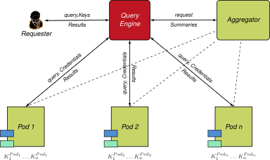
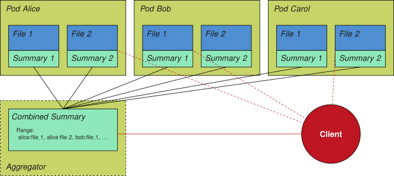
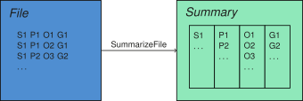
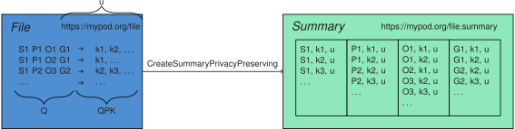
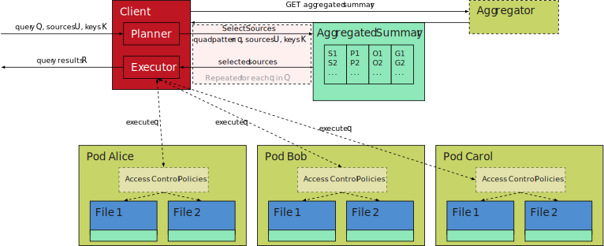
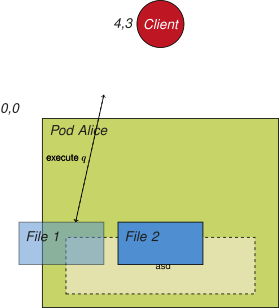

## A Privacy-Preserving Federation Framework
{:#framework}

<!-- In this section, we introduce a framework to enable querying
over decentralized environments in a privacy-preserving manner,
which provides support for use cases such as the one introduced in [](#use-case).
We put a particular emphasis on three core aspects of the framework:
(i) we introduce a high-level architecture for enabling federated querying in a privacy-preserving manner;
(ii) we list the requirements for enabling fine-grained access control in decentralized environments; and
(iii) we discuss required extensions to identity management within decentralized environments. -->

<!-- ### Privacy-Preserving Federated Querying -->

The proposed privacy-preserving federation architecture is depicted in [](#overall-architecture).
We first provide a high-level overview of the architecture, and the requirements that guide our proposal. Following on from this we introduce the various algorithms that are needed to enable efficient privacy-preserving federated querying.

{:.comment data-author="SS"}
Privacy-Preserving Federation **Architecture** or **Framework**?

<figure id="overall-architecture">

<figcaption markdown="block">
The proposed Privacy-Preserving Federation Architecture is composed of four core entities, namely Requesters, Pods, Aggregators, and Query Engines.
</figcaption>
</figure>

### Architecture Overview

Based on our use case from [](#use-case), we assume that multiple data pods exist, each potentially containing multiple privacy-constrained files.
If clients want to read the contents of these files,
they have to authenticate themselves to the respective data pod servers. Depending on each file's access control policy, the client may be authorized to read the full file contents or parts of it.

Since realistic decentralized environments could easily contain hundreds or thousands of files,
it can become inefficient for the client to query each of them.
For this reason, we make make use of the _[data summaries](cite:cites summaries)_ concept
in order to reduce the number of sources that need to be queried by the client.
We assume that each data pod exposes a data summary for each separate file, which is subsequently aggregated by third-party aggregators, as depicted in [](#figure-privacy-federation-architecture).

<figure id="figure-privacy-federation-architecture">

<figcaption markdown="block">
Overview of a privacy-preserving federation with six access restricted sources and privacy-preserving summaries,
and a third-party aggregator that combines these summaries in a privacy-preserving manner,
together with a list of all sources it summarizes.
Client-side query engines can use this combined summary to derive which sources are relevant for any given query.
</figcaption>
</figure>

Since files may contain private data, these data summaries must be _privacy-preserving_,
i.e., they must not allow access restricted data to be leaked to unauthorised individuals.
Here we assume that access policies can be represented as access keys and these keys are taken into account by the summary generation algorithm.

Pods can generate these summaries lazily on demand, either periodically or upon file changes.
An overview of this architecture can be seen in [](#figure-privacy-federation-architecture).
Following the approach from [Vander Sande et al.](cite:cites tpf_amf),
each summary consists of 4 parts, corresponding to the 4 components in RDF quads,
as illustrated in [](#figure-summary-components).
This summary approach is followed because it enables querying for any possible quad pattern combination,
where quad pattern queries are the fundamental elements of SPARQL queries.

<figure id="figure-summary-components">

<figcaption markdown="block">
Summarization of all RDF quads within a file.
The summary contains 4 parts, corresponding to all subjects, predicates, objects and graphs in the file.
The `CreateSummary` implementation depends on the type of summary,
for which [Vander Sande et al.](cite:cites tpf_amf) provide different implementations.
*Note: The summary values are not necessarily an exact representation of the way the summary is stored,
these values are merely an indication of what information is used to construct the summary.*
</figcaption>
</figure>

Similar as to how RDF triple stores such as [RDF-3X](cite:cites rdf3x)
make use of auxiliary aggregated indexes where multiple quad components are combined,
our summaries could follow a similar extension in order to reduce the number of lookups for a given quad pattern query.
Since this would however come at the cost of larger summaries,
we consider this out of scope for this work.

Using the summaries of these files, third-party aggregators can create _combined summaries_.
Since the separate summaries are expected to be privacy-preserving, the combined summaries will also be privacy-preserving,
which means that third-party aggregators will not be able to know the actual contents of the data,
and they need not necessarily be trusted parties.
In addition to exposing the combined summary,
an aggregator also needs to maintain and expose the list of sources it aggregates over,
such that clients know which data sources could potentially contribute query results.
Although in our example we consider one aggregator, in practise multiple aggregators can exist with different source ranges.

<!-- This aggregation process will be explained in more detail in [](#framework-aggregation). -->

A client-side query engine can make use of the combined summary provided by the aggregator to perform source selection before query execution, i.e., reduce the number of sources to be queried. Thus the combined summaries serve to determine the data sources that contain _relevant_ and _accessible_ data.
Finally, the data sources take care of the access control enforcement at query time, by taking into account permissions specified in terms of authorisation rules.

<!-- For each source, it should do this by testing the summary for its query using its authentication key.
If the test is true, then the client should consider this source as valid target it can query.
This client-side process will be explained in more detail in [](#framework-client). -->

{:.comment data-author="RT"}
We're using a mixture of both "file" and "data source".
We should probably stick to just one, to avoid confusion.
In the context of Solid, I think "file" makes more sense.
But we should clarify somewhere early on that we consider them equivalent.

{:.comment data-author="SS"}
Isn't "data source" the more generic term? What if I don't necessarily want to serve a raw file but an endpoint via my pod? could I do this too?

### Architecture Requirements

The main technical requirements are derived from the fact that our architecture needs to support efficient privacy-preserving query execution over personal data that is distributed across many sources.
Thus we consider the following key requirements:

<!--, where `Σ.c` and `Σ'.c` denote existing summaries, `q` denotes a quad, `q.c` denotes a quad component, `p` denotes a given access policy, `k` denotes a given access key, `u` denotes the URI for the data source, `a` denotes a mode of access, and `R` denotes query execution results:-->

1. **No data leaking**:
   Access restricted data must not be available to those who are not authorised to access it. <!--Implementations for `GenerateKey(q,p)` and `AddKey(QPK, q, p, k)` are required to generated a key for a given access policy and create a map of quads, policies and keys.-->
2. **Privacy-preserving summary creation**:
   It must be possible to add values to summaries by access key and file URI.
   <!--An implementation for `SummaryAdd(Σ.c, q.c, k, u)` is required to create the individual summaries,
   based on an initialized summary as implemented by `SummaryInitialize()`.-->
3. **Summary combinations**
   It must be possible to combine two summaries,
   where the combined summary is identical to a summary where all of the entries were added directly.
    <!--An implementation for `SummaryCombine(Σ.c, Σ'.c)` is required, based on an initialized summary as implemented by `SummaryInitialize()`..-->
4. **Authorized membership checking**
   Probabilistic membership checking must be possible for a given value, access key and file URI.
   False positives are allowed, but true negatives are required.
   <!-- We require that the file URI can be falsy, in case all file URIs must be tested. Here, an implementation for `SummaryContains(Σ.c, q.c, k, u)` is required..-->
5. **Access control enforcement**
   It must be possible for the data source to limit query results based on a set of access policies. <!--Thus there is an need for functions that identify the policies (implemented via `GetPolicies(QPK, c, q)`) that need to be considered during query execution (implemented via `ExecuteQueryWithAccessControl(c, q, p)`)..-->

{:.todo}
For this last one, should we refocus it to access control enforcement on the summaries, instead of the source itself?

RESPONSE: 1) No data leakage is the requirement which motivates the use of encryption to ensure summaries are privacy-preserving, whereas 5) access control enforcement is the requirement which motivates the SHACL constant execution at query time.
{:.todo}

{:.comment data-author="RT"}
Above, the required function implementations are commented out.
Any reason for this? If not, can these be restored?

### Access Key Creation Algorithm

The main purpose of an aggregator is to enable clients to optimize federated querying
by reducing the range of files to query over through summaries.
Since we are considering private data, these summaries need to be privacy-preserving,
which means that only people with the appropriate access rights can determine the presence of data.
The first step is to create a map of keys to quads based on existing access policies, using the algorithm outlined in [](#key-generation-algorithm). Here we assume that pod owners already have a set of access control policies that govern access to quads stored in theirs pods.

_s/list/set/ ? or does order matter? it shouldn't as we go over each policy (and generate an access key?) for each q ∈ Q anyway.._{:.sidenote}

<figure id="key-generation-algorithm" class="sidebar-comment listing">
````/code/key-generation-algorithm.txt````
<figcaption markdown="block">
Algorithm for generating keys for quads based on existing access policies, with `MapInitialize` for initializing a map between quads and keys, `GenerateKey` which generates a key for a quad based on a policy, and `AddKey` which adds a key to a map.
</figcaption>
</figure>

_one-to-one mapping between a policy and access keys? wouldn't this imply that for each quad there's a unique key **and** a unique policy? what if I have more than one policy governing access to a specific triple? this would lead to QPK(q) returning a list of (q,p) tuple?_{:.sidenote}

There is a one to one mapping between access policies that are used for policy enforcement at query time, and access keys that are used to create privacy-preserving summaries that are needed to optimize federated querying.
{:.sidebar-comment}

### Summary Creation Algorithm
{:#framework-summary-creation}

In practise, multiple aggregators can exist,
which are not necessarily trusted,
and each one should not necessarily aggregate over _all_ sources.
For example, an aggregator could be setup within a family to aggregate over all family events that may be hosted by several people,
or a company-wide aggregator can be setup to keep track of the birthdays of all employees.

{:.comment data-author="RT"}
The paragraph above doesn't really fit here IMO.
If I remember correctly, this used to be in the solution section.
Can we move it there?

In the proposed framework, data pods expose a separate summary for each file,
and aggregators create combined summaries using these separate summaries;
and maintain a list of all source URIs that they aggregate over.
We assume that pods expose summaries that are created according to the algorithm presented in [](#summarization-algorithm).
In this algorithm, a file summary is created for each quad component,
where we iterate over all the file's quads,
and the access key that are applicable for each quad.
For each of these combinations, we add the quad component to the summary,
for the given key and file source URI.
The `SummaryInitialize` and `SummaryAdd` functions that are used in the algorithm depend on the type of summary that is being used.
A high-level example of this summarization algorithm can be seen in [](#figure-summary-components-privacy).

*What's the signature of QPK? in an earlier version of the algorithm it was `QPK<q,item<p,k>> = MapInitialize()`, which wouldn't work for something like `FOREACH k in QPK(q)` right? If `QPK: Q -> P × K`, i.e. each quad maps to a tuple consisting of a policy p and key k, **then `QPK(q)` would actually return only one element -> the tuple `(p,k)`**.. right?*{:.sidenote}

<figure id="summarization-algorithm" class="listing">
````/code/summarization-algorithm.txt````
<figcaption markdown="block">
Algorithm for creating a summary over a file within a data pod,
with `SummaryAdd` a summary-type-dependent function for adding a quad component, key, and file URI to summary,
and `SummaryInitialize` a summary-type-dependent function for initializing a new summary.
</figcaption>
</figure>
{:.sidebar comment}

<figure id="figure-summary-components-privacy">

<figcaption markdown="block">
Privacy-preserving summarization of all RDF quads (`Q`) within a file (`u`),
based on a set of quad-dependent keys that are derived using a mapping function `QPK`.
*Note: The summary values are not necessarily an exact representation of the way the summary is stored,
these values are merely an indication of what information is used to construct the summary.*
</figcaption>
</figure>

### Summary Combination Algorithm
{:#framework-summary-aggregation}

Based on the resulting file summaries,
the aggregator can create a combined summary using the algorithm from [](#aggregation-algorithm).
As before, the `SummaryInitialize` and `SummaryCombine` functions that are used in these algorithms
depend on the type of summary that is being used.
[](#figure-summary-components-privacy-aggregated) shows a high-level example of how this aggregation can happen in practise.

<figure id="aggregation-algorithm" class="listing">
````/code/aggregation-algorithm.txt````
<figcaption markdown="block">
Algorithm for creating a combined summary over a set of sources,
with `SummaryCombine` a summary-type-dependent function for combining two summaries,
and `SummaryInitialize` a summary-type-dependent function for initializing a new summary.
</figcaption>
</figure>

<figure id="figure-summary-components-privacy-aggregated">

<figcaption markdown="block">
Privacy-preserving aggregation of multiple summaries.
*Note: The summary values are not necessarily an exact representation of the way the summary is stored,
these values are merely an indication of what information is used to construct the summary.*
</figcaption>
</figure>

In practise, summaries and combined summaries require some bookkeeping.
Each file summary must remain up-to-date with respect to the file's contents.
This could be done by either immediately invalidating the summary upon file changes,
or by periodically regenerating the summary.
The combined summary requires similar actions to avoid going stale.
This can be achieved through immediate notifications from the pod to the aggregator upon file changes,
or the aggregator can periodically scan the files or its summaries for changes.

### Client-side Querying Algorithm
{:#framework-client}

Since file-based APIs are the basis for data retrieval on the Web as prescribed by the HTTP protocol,
we assume this as a starting point for federated querying in decentralized environments.
Furthermore, we consider quad pattern-based access to file sources instead of more complex [SPARQL queries](cite:cites spec:sparqllang).
This is because triple and quad patterns are the fundamental elements of SPARQL queries,
and any SPARQL query can be decomposed into multiple smaller quad pattern queries.
For example, client-side query engines such as [Comunica](cite:cites comunica) decompose any SPARQL query
into a sequence of quad pattern queries for evaluation against heterogeneous sources,
where the results of these quad pattern queries are joined together locally.
More complex SPARQL features such as `FILTER` and aggregates are fully handled client-side.
Although intelligent clients could detect more expressive interfaces such as
[SPARQL endpoints](cite:cites spec:sparqlprot) and [Triple Pattern Fragments](cite:cites ldf) interfaces,
and make use of them during query execution, we consider this out-of-scope for this work.

Assuming we have an aggregator exposing a summary over a set of sources,
we introduce the algorithm in [](#client-algorithm) where a client-side query engine can make use of an aggregator's summary
to reduce the number of sources the client should query over, i.e., to _source selection_.
As input, this algorithm assumes a quad pattern query,
the list of access keys provided by the user,
and the summary and list of sources it obtained from an aggregator.
Based on these inputs, the client will iterate over all non-variable quad components
and all available keys.
For each combination, it will first do a pre-filtering step before locally iterating over all sources.
It will check whether or not the component value
is present in the summary for the current key and component,
with source URI set to `ε` to match with all sources.
If it is not present, then we return an empty array, as none of the sources will contain the given component value.
If it is present, some of the sources _may_ contain the component value,
because we consider summaries as being probabilistic.
After that, we iterate over each source URI, and check its presence in the summary of the current component,
combined with the component value and key.
When a true negative is found for a source, this source is removed from the list of sources.
Finally, the remaining list of sources is returned,
which can be used by the query engine to execute the quad pattern query over.
In this algorithm, the `SummaryContains` also depends on the type of summary that is being used.
[](#figure-query-execution) shows an example of how this source selection algorithm can be used in client-side query engines.

*in [](#figure-query-execution) we use `q` to denote a single quad and `Q` for a query.. is `q` now a single quad or a quad pattern query?*{:.sidenote}

<figure id="client-algorithm" class="listing">
````/code/client-algorithm.txt````
<figcaption markdown="block">
Client-side algorithm for selecting query-relevant sources for a quad pattern query
based on a given privacy-preserving summary.
`SummaryContains` is a summary-type-dependent function for checking if a summary contains a given quad component
for a given key and source URI.
</figcaption>
</figure>
{:.sidebar-comment}

<figure id="figure-query-execution">

<figcaption markdown="block">
Federated query execution using a privacy-preserving summary.
*Note: The summary values are not necessarily an exact representation of the way the summary is stored,
these values are merely an indication of what information is used to construct the summary.*
</figcaption>
</figure>

The presented algorithm should be seen as a basis for federated querying over decentralized environments with private data,
where there is a single aggregator, and all sources we want to query over are considered by the aggregator.
In practise, multiple aggregators can exist,
they may apply to overlapping sources,
and some sources may not be aggregated at all.
For these cases, extensions to this algorithm will be needed,
which we consider out-of-scope for this work.

### Access Control
{:#framework-access-control}

Once the client has obtained the list of sources that it needs to query, the next step is to execute the query against each source.
Here there is a need for access control enforcement, such that it is possible to check that a client does in fact possess the credentials necessary to execute the request.

<figure id="client-algorithm" class="listing">
````/code/request-algorithm.txt````
<figcaption markdown="block">
Client-side algorithm for querying query-relevant sources.
`ExecuteQuery` is a function that executes a query (i.e. request) against a particular source. For access control purposes, a client identification (e.g., WebID) has to be provided by the client together with the respective query.
</figcaption>
</figure>


{:.comment data-author="RT"}
It is not clear to me if this section is talking about the client-side part (clients sends auth query to the server), or the server-side part (server checks client auth, and only emits quads that are authorized for this auth).
We might even want to create two separate dedicated sections for this.

#### Server-side Access Control (Authorization)

In the proposed algorithm a map relating quads to policies and keys is used to identify access policies that govern a particular query. We assume that there may be multiple policies that govern a particular quad and thus envisage a simple conflict resolution strategy whereby either prohibitions override permissions or visa versa. The algorithm stops as soon as it finds a policy that permits the given query to be executed and returns the results of the query execution.

<figure id="figure-request-processing" class="figure">

<figcaption markdown="block">
A server validates requests `r ∈ R` with `r = ⟨i, a, q⟩` consisting of the requester's client identification `i`, the requested access mode `a`, and a quad pattern query `q`, against a set of _applicable_ access control policies `P'⊆ P`.
A policy `p ∈ P'` with `p = ⟨s, a, o⟩` is _applicable_ to a request `r ∈ R` if the request conforms to the shape; policy `p` was specified against.
</figcaption>
</figure>

<figure id="access-control-algorithm" class="listing">
````/code/access-control-algorithm.txt````
<figcaption markdown="block">
An algorithm that takes the requesters credentials, the requested access right, a quad pattern, and a policy, and returns the query execution results. The algorithm is composed of an `AllowedAccess` function that checks if access is permitted, and an `ExecuteQueryWithAccessControl` function that executes a query and adds the result to the result list.
</figcaption>
</figure>
