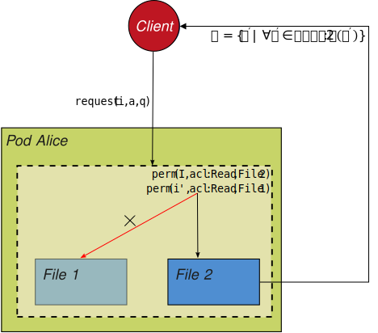

## A Possible Instantiation
{:#solution}

In this section, we present an instantiation of the proposed framework and identify challenges that need to be addressed, placing a particular focus on techniques for access policy specification, summarization generation and maintenance, and access control enforcement.

ALL: We should revisit our use case scenario here
{:.todo}

### Access Policy Specification

We assume that pod owners need to be able to specify access control policies that can be enforced both from an indexing and also a query processing perspective, taking into consideration the following core requirement:

* **No data leaking**: Access restricted data must not be available to those who are not authorised to access it. 

From a policy specification perspective, our pod owners (Alice, Bob, and Carol) could create three separate files that are used to distinguish between data that is accessible by: _everyone_, _acquaintances_, and _friends_. In such a scenario, authorisations could abstractly be represented as lists of _roles_, _access rights_, and _pods_, such that: 

* Rule *R1C*, which states that everyone has read access to the name property, is represented as `<everyone, read access, everyone file>`, where name is stored in the everyone file.

* Rule *R2C*, which states that acquaintances have read access to the e-mail property, is represented as `<acquaintances, read access, acquaintances file>`, where e-mail is stored in the acquaintances file. 

* Rule *R3C*, which states that friends have read access to the telephone number property, is represented as `<friends, read access, friends file>`, where the telephone number is stored in the friends file. 

In order to support privacy preserving summaries, there is a need to generate access keys for both the acquaintances and the friends files, such that the summary generation process does not work with plain text attributes but rather cipher text. Given that data in the everyone file is public by default, no key is needed. 

In this paper we propose that there is a one to one mapping between protected (i.e. non public files) and access keys that are used to create data summaries. Our initial proposal makes use of simple symmetric keys, however for more complex scenarios both attribute based encryption and/or key derivation algorithms could be use to provide support for more complex access policies.    

When to comes to policy management, there is a need to ensure that (i) access keys are tightly bound to access policies, and (ii) said keys are distributed to authorised individuals (i.e. acquaintances and friends). In order to revoke access to a particular individual one would need to regenerate the keys and redistribute them to authorised individuals. 

### Summary Generation and Maintenance

The technical requirements for enabling federated querying in an efficient manner through privacy-preserving aggregators are mainly driven by the summarization technology. In this context symmetric keys are used to create privacy preserving summaries that do not leak access restricted data. In the following with discuss the role played by Bloom filters when it comes to constructing privacy preserving data summaries. Following on from this we highlight challenges with respect to parameter handling and source-aggregator communication.

#### Constructing Privacy Preserving Data Summaries 

We consider Approximate Membership Functions (AMFs), such as Bloom filters or GCS
one possible candidate for such summaries that meet the following requirements:

* **Value additions**:
    Additions to Bloom filters are possible by inserting a bit string.
    `SummaryInitialize() = 0` and
    `SummaryAdd(Σ.c, q.c, k, u) = Σ.c | (q.c & k) | u`
* **Summary combinations**
    Bloom filters can be combined by `OR`-ing them.
    `SummaryCombine(Σ.c, Σ'.c) = Σ.c | Σ'.c`.
* **Authorized membership checking**
    Membership in Bloom filters can be tested by hashing the value,
    and checking its membership inside the filter.
    `SummaryContains(Σ.c, q.c, k, u) = Σ.c[(q.c & k) | u]`.

The main advantage of using AMFs such as Bloom filters is that all of the performance-critical operations on summaries (adding, combining, membership checking) can happen very efficiently, as these are essentially just bitwise operations.

#### Parameter Handling

When using AMFs, it is important to take account that these have certain parameters,
and that all operations must be known before any operation can be done with them.
For example, for Bloom filters the parameters are the number of hashes and bits.
These parameters and the number of entries all impact the false positive error rate.
Concretely, these parameters have to be identical before AMFs can be combined within an aggregator,
and they have to be known before a client can make use of them.

In a decentralized environment, it is however difficult to reach a consensus between all parties to use fixed parameters.
Furthermore, since the number of values within an AMF has an impact on the error rate,
it is sometimes even required to use different parameters for different numbers of entries.
As such, no single set of AMF parameters should be used.
This does however mean that a parameter determination mechanism is needed for aggregators
that want to combine multiple AMFs.
This mechanism is driven by the file sizes within each data pod,
and by the number of sources the aggregator works over.
Once the aggregator has determined these numbers,
it can determine an appropriate set of AMF parameters,
which must then be sent to each data pod to trigger an AMF creation for the requested file under the given set of parameters.
In cases where many aggregators request such AMFs,
the data pods may decide to only support a fixed set of parameters to reduce the load on them, and to enable caching of AMFs.
For this, some kind of parameter negotiation may be required between the aggregator and all data pods.

#### Source-Aggregator Communication

Different  *push* and *pull* based techniques can be used to trigger aggregated summary creation. 
Push based techniques require the aggregators to *subscribe* to the sources, after which the sources could *notify* the aggregators upon any change, after which the aggregators could restart aggregated summary creation. 
Pull based techniques require the aggregator to periodically poll the applicable sources. Once the aggregator detects a change in one of the sources, the aggregated summary creation could restart.
[Linked Data Notifications](cite:cites spec:ldn) is one possible technique for sending such notifications. In practise, there is a need to support both push and pull based techniques, for instance when only some sources support change subscriptions, which means that other sources will require polling.

### Source Selection

We should describe how the query engine makes use of the data summaries in order to reduce the number of data sources to be queried.
{:.todo}

### Query Execution

Once the query engine has identified the data sources that could potentially contribute results to their query, the query engine needs to authenticate to the server(s) and execute the query or parts thereof. In turn the server is responsible for authenticating the requested, enforcing access control, and executing the query or parts thereof. Concretely, we address the following core requirement:

* **Access control enforcement** It must be possible for the data source to limit query results based on a set of access policies. 

#### Authentication

Web Identity and Discovery, is a mechanism used to uniquely identify and authenticate a person, company, organisation or other entity, by means of a URI. Essentially a WebID is a HTTP URI that should: (i) be under the control of the entity it describes; (ii) be linkable on the web; (iii) describe the entity is represents; (iv) enable authentication and access control; (v) respect the privacy of the entity it describes; (v) rely solely on HTTP and semantic Web technologies. A description of the agent is provided in an RDF document, known as a WebID profile, which can be dereferenced using 303 or Hash URI's. The WebID-TLS protocol (where TLS stands for Transport Layer Security) specifies how together the WebID profile and public key certificates, can be used to authenticate users. The user places their WebID profile document URI in the *Subject Alternative Names* field of their certificate. Once the certificate has been generated the user adds the public key details to their WebID profile document. A service wishing to  authenticate the user, needs to verify that the public key of the certificate it receives matches the public key specified in the WebID profile.

#### Access Control Enforcement

For enforcement purposes the simple access control lists are translated into SHACL shapes that allow for constraining, i.e., shaping  and (i) the **agents/party** whose requests the policy applies to; (ii) the **action/mode** that is permitted to be performed on the resource; and (iii) the **resources** that can be accessed/should be returned,

<figure id="figure-request-processing">

<figcaption markdown="block">
A server matches requests consisting of a client identifiation `i`, the requested access mode `a`, and a quad pattern query `q`, against a set of access control policies `P`.
A policy `p ∈ P` is applicable for a request `[i, a, q]` if the request conforms to the shape; policy `p` was specified against.
</figcaption>
</figure>

SIMON: Change this figure and the example so that it aligns with the use case scenario
{:.todo}

<figure id="figure-acl-graph" markdown="block" style="background: #FFFFFF">

~~~ turtle

@prefix acl: <http://www.w3.org/ns/auth/acl#> .
@prefix odrl: <http://www.w3.org/ns/odrl/2/> .
@prefix rdf: <http://www.w3.org/1999/02/22-rdf-syntax-ns#> .
@prefix rdfs: <http://www.w3.org/2000/01/rdf-schema#> .
@prefix sh: <http://www.w3.org/ns/shacl#> .

<http://alice.pod/share/policy>
    a sh:NodeShape ;
    sh:rule [
        a sh:SPARQLRule ;
        sh:construct """
            CONSTRUCT {
                ?s ?p ?o
            } WHERE {
                GRAPH <http://alice.pod/share/file1> {
                    ?s ?p ?o
                }
            }
        """ ;
        sh:condition [
            sh:property [
                sh:path odrl:assignee ; # the requesting agent
                sh:node [
                    a sh:PropertyShape ;
                    sh:path [ sh:inversePath foaf:member ] ;
                    sh:hasValue <http://company1/> ;
                ] ;
                sh:node [
                    a sh:PropertyShape ;
                    sh:path vcard:hasEmail ;
                    sh:minCount 1 .
                ]
            ] ;
            sh:property [
                sh:path odrl:action ; # the requested mode of access
                sh:hasValue acl:Read ;
            ] ;
        ] ;
    ] ;
~~~

<figcaption markdown="block">
Access Control Policy
</figcaption>
</figure>

<!--
This allows for expressing more fine-grained access control policies, such as:
* As outlined in , shapes languages such as [SHACL](cite:cites spec:shacl), specifically address the need to constrain the data in a graph to a certain shape
* shapes (SHACL/ShEx) and [using shapes for Web APIs](cite:cites hypermedia_shapes)
* (shacl-spec): validation-based (~filter) and (shacl note): filter/rule-based (related https://github.com/solid/data-interoperability-panel/issues/34)
{:.todo}
-->

<!--
* Data owners are responsible for enforcing access control (as opposed to other approaches where federation engine takes care of that). We assume that access control is already taken care of at the (client-side) federation engine.
* Build on Solid's WebID-OIDC for auth, and WAC for access control.
* Allow shape-based/quadpattern-based (SHACL/SHEX) access modes in .acl files. (advantage of shapes is that fewer keys may be needed, which reduces the complexity of key mgmt) (motivation for keys is that Solid is going to use it for data validation: https://github.com/solid/data-interoperability-panel/blob/b2591bf2f8808972e5459db2aa4ac8d9854f5b5e/data-validation/use-cases.md)
* Right now, we do it role-based, but it could be attribute-based as well.
{:.todo} -->

