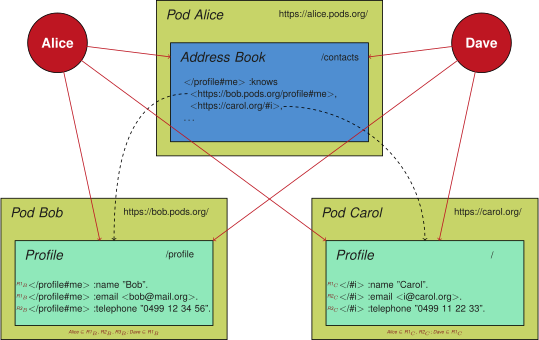

## Use Case: Personalized Address Book
{:#use-case}

In the scope of this work, we consider the use case of a personalized address book,
where the address book is merely a list of WebIDs,
and the actual details of each contact is stored in their own respective pod.
To keep this use case simple, we assume an address book of Alice that contains two contacts: Bob and Carol.
In practise, such an address book could contain much more contacts.
Alice has chosen to make this address book public,
so that everyone is able to see everyone she knows,
without necessarily having access the everyone's private contact details.
We also consider Dave as a fourth person that has no relationship with anyone else.

For the sake of simplicity, we consider three hierarchical authorization roles per pod,
where the members of each role can be configured for each pod:

* *R1*: Everyone (without authentication)
* *R2*: Acquaintances (inherits from *R1*)
* *R3*: Friends (inherits from *R2*)

 shows a detailed overview of this use case.
Alice uses the `/contacts` file in her pod to list everyone that she knows using their WebID,
which point to the profiles of the respective people.
The profiles of Bob and Carol both contain their name, email and telephone number,
which are readable for select people.
Bob is quite liberal, and allows everyone (*R1B*) to read both his name and email.
His telephone number is however only readable for friends (*R3B*).
Bob considers Alice a friend (*R1B*, *R2B*, *R3B*).
Carol only allows her name to be read by the public (*R1C*),
her email is only readable by acquaintances (*R2C*),
and her telephone number by friends (*R3C*).
Carol considers Alice an acquaintance (*R1C*, *R2C*).

<figure id="figure-use-case">

<figcaption markdown="block">
Overview of the personalized address book use case where Alice, Bob and Carol have a data pod,
and Alice and Dave aim to read certain data.
Alice has an address book that contains links to the profiles of Bob and Carol.
All triples in each profile are annotated with a role for users that can read that triple.
Full lines indicate data reading by people,
and dashed lines indicate data links.
</figcaption>
</figure>

For this use case, we consider the following example queries:

1. **Alice wants to send an email to everyone she knows.**
     
    Alice is able to read the email of both Bob and Carol.
    Because Bob's email is readable for everyone (*Alice ∈ R1B*),
    and Carol's email is readable for acquaintances (*Alice ∈ R2C*).
2. **Alice wants to call everyone she knows.**
     
    Alice is able to read the telephone number of Bob, but not Carol.
    Because Bob's telephone number is readable for friends (*Alice ∈ R3B*),
    but Carol's telephone number is only readable for her friends (*Alice ∉ R2C*).
3. **Dave wants to send an email to everyone Alice knows.**
     
    Dave is able to read the email of Bob, but not Carol.
    Because Bob's email is readable for everyone (*Dave ∈ R1B*),
    and Carol's email is only readable for acquaintances (*Dave ∉ R2C*).
4. **Dave wants to call everyone Alice knows.**
     
    Dave is not able to read the telephone number of Bob or Carol.
    Because Bob's telephone number is readable for friends (*Dave ∉ R3B*),
    but Carol's telephone number is only readable for her friends (*Dave ∉ R2C*).
