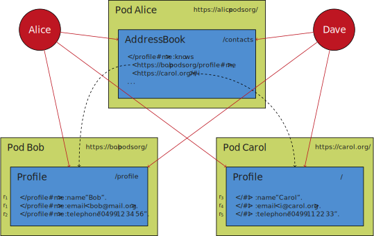

## A Personalized Address Book Use Case Scenario
{: #use-case}

Before presenting our privacy-preserving federation framework we first provide a high level overview of our personalized address book use case scenario,
where the address book is merely a list of WebIDs,
and the actual details of each contact is stored in their own respective pod.
To keep this use case simple, we assume an address book of Alice that contains two contacts: Bob and Carol.
In practise, such an address book could contain many more contacts.
Alice has chosen to make this address book public,
so that everyone is able to see everyone she knows,
albeit without necessarily having access to everyone's private contact details as these are controlled via separate access control policies.
We also consider Dave as a fourth person that has no relationship with anyone else.

For the sake of simplicity, we consider three hierarchical subject groups per pod,
where the members of each group can be configured for each pod:

- $$S_E$$: Everyone (without authentication)
- $$S_A$$: Acquaintances ($$S_A \subseteq S_E$$)
- $$S_F$$: Friends ($$S_F \subseteq S_A$$)

<!--
{::options parse_block_html="true" /}

  <strong>Roles, Rules and Confusion</strong>\\
  Later on (i.e., ) we use `R1C, R2B, etc.` to indicate `Rules` of Carol, Bob,... Also, the current description above may be focusing too much on the **Role** part, rather than roles being just one of the aspects of a policy.. What about something along the lines of:

- a policy `p` consisting of a set of rules `R` where each rule `r` is represented as \\
  a tuple `r = ⟨t, s, a, o⟩` with
  - `t ∈ {perm,proh,obl}` - specifying the `type` of the rule \*
  - `s` - the party/user/group... to which this rule applies to (WHO)
  - `a` - the action/mode/... to be executed (HOW)
  - `o` - the resource/asset/asset group/... in question (WHAT)

\* TBD → only required if we want to add the concept of _obligations_ at some point too.. otherwise, every `r` would represent an explicit permission, thus if there's no applicable rule for a request the request should be denied (prohibition)

{::options parse_block_html="false" /} -->

*still not happy about the formatting 😢  any ideas on how to fix that? @ruben*{:.sidenote}

 shows a detailed overview of this use case.
Alice uses the `/contacts` file in her pod to list everyone that she knows using their WebID,
which point to the profiles of the respective people.
The profiles of Bob and Carol both contain their name, email and telephone number,
which are readable for select people.
{:.sidebar-comment}

Bob is quite liberal, and allows everyone (_SE_) to read both his name and email:

<em>r1 = ⟨{s | s ∈ SE}, read, {q | q ∈ ProfileB ∧ q.predicate ∈ {:name,:email}}⟩</em>
{: style="text-align: center"}

His telephone number is however only readable for friends:

<em>r2 = ⟨{s | s ∈ SF}, read, {q | q ∈ ProfileB ∧ q.predicate ∈ {:telephone}}⟩</em>
{: style="text-align: center"}

Bob considers Alice a friend:

_`<https://alice.pods.org/profile#me>` ∈ SF ⊆ SA ⊆ SE_
{: style="text-align: center"}

Carol only allows her name to be read by the public:

<em>r3 = ⟨{ s | s ∈ SE}, read, {q | q ∈ ProfileC ∧ q.predicate ∈ {:name}}⟩</em>
{: style="text-align: center"}

Her email is readable by acquaintances:

<em>r4 = ⟨{ s | s ∈ SA}, read, {q | q ∈ ProfileC ∧ q.predicate ∈ {:email}}⟩</em>
{: style="text-align: center"}

And her telephone number by friends:

<em>r5 = ⟨{ s | s ∈ SF }, read, { q | q ∈ ProfileC ∧ q.predicate ∈ {:telephone}}⟩</em>
{: style="text-align: center"}

Carol considers Alice an acquaintance:

_`<https://alice.pods.org/profile#me>` ∈ SA ⊆ SE_
{: style="text-align: center"}

*- update rules   - Alice's Address Book, as well as Bob's and Carol's respective profiles are considered being "Files" in our terminology, right? if yes, why are they coloured differently and why do profiles have the same color as summaries? imo, we should use colors of core components like summaries/pods/.. for the respective components only.   - should we move the rules from below the profile to above of it, surrounded by an `Access Policy` block like in ?*{:.sidenote}

<figure id="figure-use-case" class="sidebar-comment">

<figcaption markdown="block">
Overview of the personalized address book use case where Alice, Bob and Carol each have separate data pods.
Alice has an address book that contains links to the profiles of Bob and Carol.
All triples in each profile are annotated with a role for users that can read that triple.
Full lines indicate data reading by people,
and dashed lines indicate data links.
</figcaption>
</figure>

<!--

**Bob is quite liberal, and allows everyone to read both his name and email.**

- \$$r1_B = \langle\{s\;\vert\;s \in S_E\}, read, \{o\;\vert\;o \in File_B \wedge o \subseteq \{name, email\}\}\rangle$$

**His telephone number is however only readable for friends.**

- `r2``B` `= ⟨{s | s ∈ Friends``C``}, read, {o | o ∈ File``Friends``B``∧ o ⊆ {telephone number}⟩`

**Bob considers Alice a friend**

- `Alice ∈ S``F``, S``F``⊆ S``A``⊆ S``E`
- `Alice ∈ S``F``, Alice ∈ S``A``, Alice ∈ S``E`
- `{Alice} ⊆ S``F`` ⊆ S``A``⊆ S``E`

**Carol allows only her name to be read by the public**

- `r1``C` `= ⟨{s | s ∈ Everyone}, read, {o | o ∈ File``Everyone``∧ o ⊆ name}⟩`

**Her email is only readable by acquaintances**

- `r2``C` `= ⟨{s | s ∈ Acquaintances``C``}, read, {o | o ∈ File``Acquaintances``C``∧ o ⊆ email}⟩`

**Her telephone number is readable by friends only**

- `r3``C` `= ⟨{s | s ∈ Friends``C``}, read, {o | o ∈ File``Friends``C``∧ o ⊆ telephone number}⟩`

**Carol considers Alice a acquaintance**

- Alice $$\in S_A\subseteq S_E$$
- Alice $$\notin S_F$$, Alice $$\in S_A$$, Alice $$\in S_E$$ -->

For this use case, we consider the following example queries:

*replace justifications with references to Authorization Rules*{:.sidenote}

1. **Alice wants to send an email to everyone she knows.**
    
   Alice is able to read the email of both Bob and Carol.
   Because Bob's email is readable for everyone (_Alice ∈ R1B_),
   and Carol's email is readable for acquaintances (_Alice ∈ R2C_).
2. **Alice wants to call everyone she knows.**
    
   Alice is able to read the telephone number of Bob, but not Carol.
   Because Bob's telephone number is readable for friends (_Alice ∈ R3B_),
   but Carol's telephone number is only readable for her friends (_Alice ∉ R2C_).
3. **Dave wants to send an email to everyone Alice knows.**
    
   Dave is able to read the email of Bob, but not Carol.
   Because Bob's email is readable for everyone (_Dave ∈ R1B_),
   and Carol's email is only readable for acquaintances (_Dave ∉ R2C_).
4. **Dave wants to call everyone Alice knows.**
    
   Dave is not able to read the telephone number of Bob or Carol.
   Because Bob's telephone number is readable for friends (_Dave ∉ R3B_),
   but Carol's telephone number is only readable for her friends (_Dave ∉ R3C_).
{:.sidebar-comment}

SABRINA check use case and examples are aligned
{:.todo}
